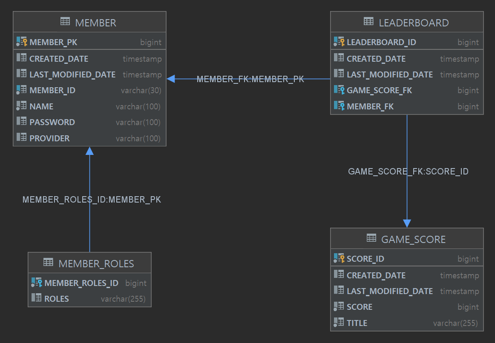
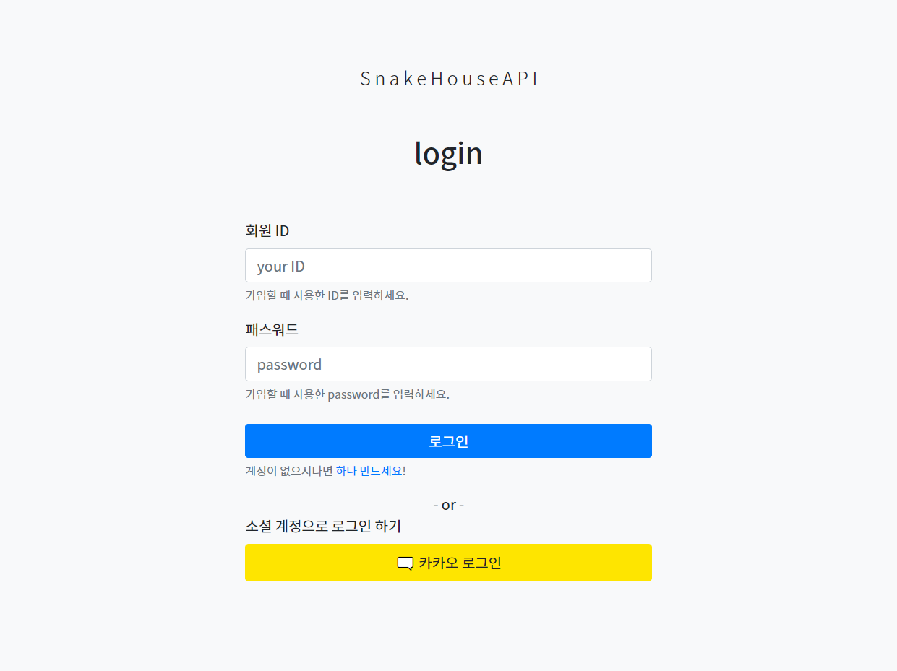
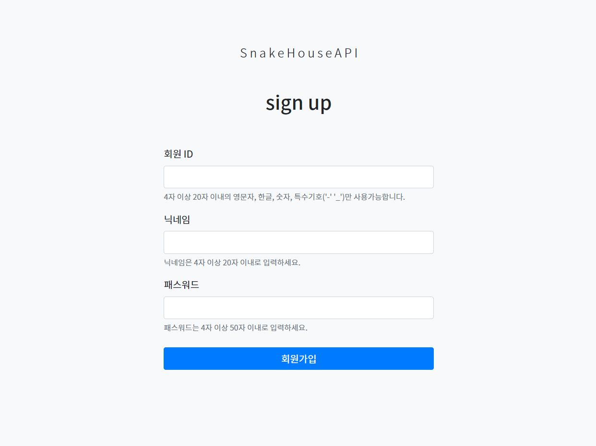
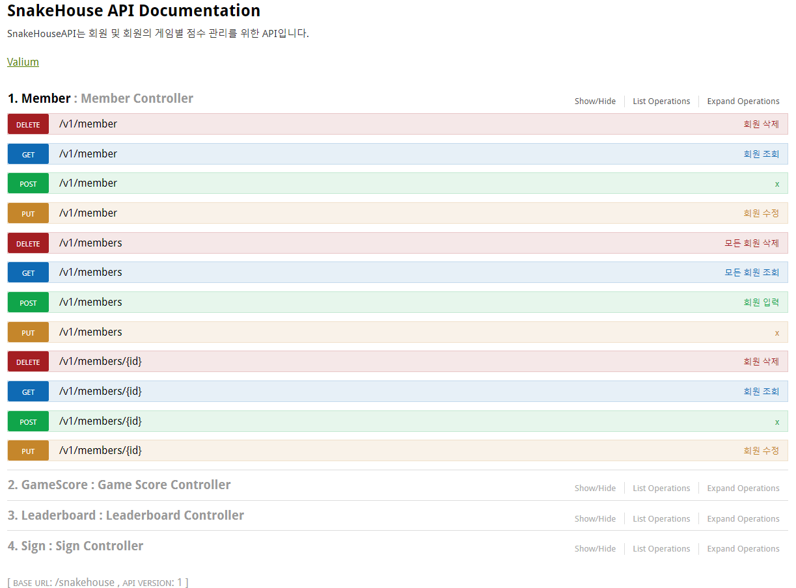

# SnakeHouseAPI

## 프로젝트 개요
SnakeHouseAPI는 회원 및 회원의 게임별 점수 관리를 위한 Restful API입니다.

## 프로젝트 서론
REST API 개발 점검용 개인 프로젝트로 시작했습니다. 
더불어 Redis를 이용한 캐싱, 소셜 로그인 경험을 프로젝트에 녹이고 싶어
관련 기능을 같이 구현했습니다.

## 프로젝트 정보
수행 기간: 2주 ~ (서비스 운영 유지보수 중)   
프로젝트 범위: 개인 프로젝트    
내 역할: 프로젝트 전체

## 사용 기술 스택
BuildTool
* gradle

Library
* Spring Boot (2.5.x)
* Spring Web MVC
* Spring Data JPA
* Spring Data Security
* Spring Data Redis (embedded)
* Spring Boot Devtools
* H2
* Lombok
* Thymeleaf

Front
* BootStrap 5

General
* Linux (데비안 10)
* SSL/TLS (Let's Encrypt)
* swagger2 (2.6.1)

## 프로젝트 이후 성과
* Restful API 설계 경험
* Embedded Redis를 이용한 캐싱 경험
* Oauth2 방식의 로그인 구현 경험

## 프로젝트 설명
### UML

### Web
#### Sign-in

#### Sign-up

### API
#### Documentation page

